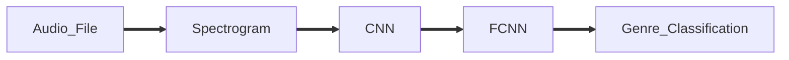

# Music Genre Classification
This project aims to develop a machine learning model that can accurately classify music into different genres. The model utilizes GTZAN dataset to train and evaluate its performance. By analyzing the audio features and leveraging advanced machine learning techniques, the model can predict the genre of a given music sample.

## Dataset
The GTZAN dataset used for this project consists of a large collection of audio files, each belonging to one of several predefined genres. The audio files are in a compatible format WAV and come with corresponding genre labels.

## Model Architecture
The music genre classification model is built using a deep learning approach, specifically a convolutional neural network (CNN). The CNN architecture allows the model to automatically extract relevant features from the audio signals. The input audio samples are transformed into spectrograms, which are then fed into the CNN for genre classification.

The classification task was performed with two different CNN:
1. Using self-built CNN
2. Using Res-Net 18 

## Sequence of Classification

- An audio file is imported
- The waveform and sample rate of the audio file is extracted
- From this waveform, Its spectrogram is generated
- This spectrogram is fed into a CNN
- The output of the CNN is fed into a FCNN
- From FCNN the classified music genre is obtained

---

## Graphs

### Self-Built CNN Loss
.png)

### Self-Built CNN Accuracy
.png)

### Res-Net 18 Loss
.png)

### Res-Net 18 Accuracy
.png)

## Results
> Max Training Set Accuracy : 100%

> Max Test Set Accuracy : 75%
